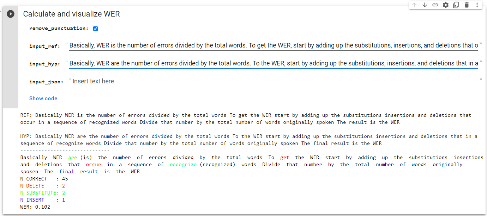
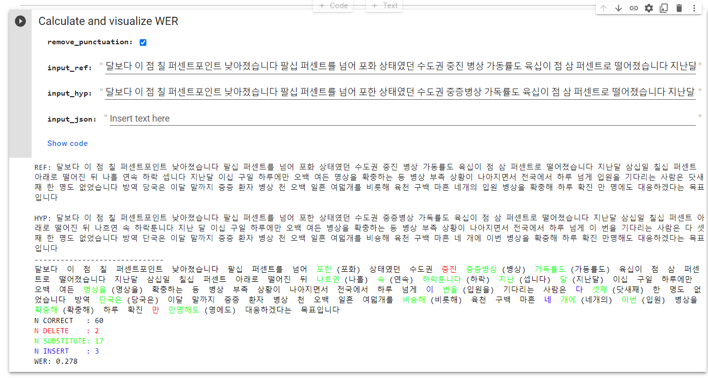

# Word Error Rate Visualization with Colab
Word Error Rate (WER) Calculation and Visualization in Colab | Comparing two texts with colors

[](https://colab.research.google.com/github/duckyngo/Word-Error-Rate-Visualization-with-Colab/blob/main/1.WER_Calculation_And_Visualization.ipynb)

:zap: A fast & easy way to calculate and vizualize WER with Colab :zap:
---
## Features
* Easy to run with Google Colab
* Show WER (Delete, Insert, Substitute) with colors
* Quick operation with Google Colab Form and auto-execute cell when field changes

## Screenshots

<p float="left">
    
    
</p>

## Reference:


## **License**
```
    Copyright 2022 Duc Ky Ngo
    
    Licensed under the Apache License, Version 2.0 (the "License");
    you may not use this file except in compliance with the License.
    You may obtain a copy of the License at
    
        http://www.apache.org/licenses/LICENSE-2.0
    
    Unless required by applicable law or agreed to in writing, software
    distributed under the License is distributed on an "AS IS" BASIS,
    WITHOUT WARRANTIES OR CONDITIONS OF ANY KIND, either express or implied.
    See the License for the specific language governing permissions and
    limitations under the License.
```